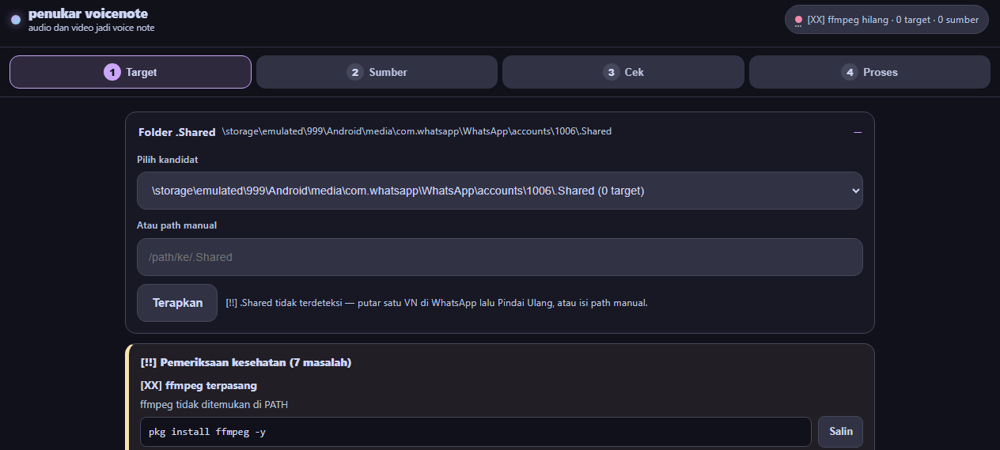
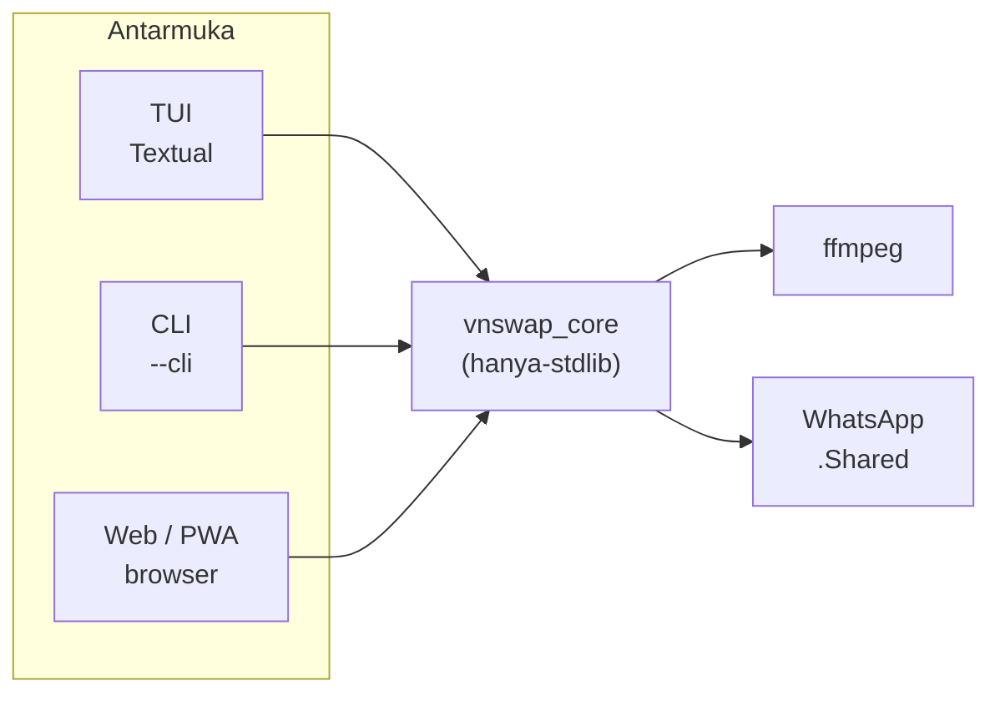

# vnswap-tui


<p align="center">
  
</p>

<p align="center">
<a href="https://github.com/ArchDityaa/vnswap-tui/actions"></a>
<a href="https://github.com/ArchDityaa/vnswap-tui/releases"></a>
<a href="LICENSE"></a>

<a href="https://termux.dev/"></a>
</p>

Tukar voice note WhatsApp langsung dari Termux. Sepenuhnya di perangkat — tanpa situs web, tanpa unggah.

Tiga antarmuka, satu mesin: **TUI** layar penuh (Textual), **CLI** mode teks, dan **Web/PWA** yang bisa dipasang ke layar utama HP — semuanya memakai ulang `vnswap_core` (hanya-stdlib) dan `ffmpeg`.

## Daftar Isi

- [Mulai Cepat](#mulai-cepat)
- [Tangkapan Layar](#tangkapan-layar)
- [Teknologi](#teknologi)
- [Mengapa vnswap](#mengapa-vnswap)
- [Fitur](#fitur)
- [Arsitektur](#arsitektur)
- [Persyaratan](#persyaratan)
- [Instalasi](#instalasi)
- [Penggunaan](#penggunaan)
- [Alur Kerja](#alur-kerja)
- [Antarmuka Web](#antarmuka-web)
- [Keamanan](#keamanan)
- [Sumber yang Didukung](#sumber-yang-didukung)
- [Struktur Proyek](#struktur-proyek)
- [Privasi & Ketentuan](#privasi--ketentuan)
- [Pemecahan Masalah](#pemecahan-masalah)
- [Roadmap](#roadmap)
- [Kontributor](#kontributor)
- [Berkontribusi](#berkontribusi)
- [Lisensi](#lisensi)

## Mulai Cepat

Sudah clone, tinggal buka TUI:

```bash
python vnswap.py
```

Termux baru, cukup salin-tempel sekali — memasang dependensi, meng-clone repo, memberi akses penyimpanan, lalu membuka TUI:

```bash
pkg install python ffmpeg git -y && pip install textual && git clone https://github.com/ArchDityaa/vnswap-tui && cd vnswap-tui && termux-setup-storage && python vnswap.py
```

Belum yakin lingkungan siap? Jalankan dulu:

```bash
vnswap health
```

## Tangkapan Layar

Banner pemeriksaan kesehatan di web — setiap masalah disertai perintah perbaikan + tombol **Salin**:



## Teknologi

<p>


</p>

## Mengapa vnswap

WhatsApp menyimpan voice note sebagai file berpasangan (audio `.opus` + sidecar visualisasi `.data`). vnswap mengganti keduanya secara atomik: me-re-encode sumber audio/video apa pun menjadi stream Opus yang kompatibel dan membuat ulang visualisasi 20 bar/detik, sehingga note hasil swap diputar secara native di WhatsApp.

Logika konversi mengikuti implementasi web:

- `src/lib/ffmpeg.ts` → `vnswap_core.py` (rencana encode)
- `src/lib/waveform.ts` → kurva visualisasi 20 bar/detik
- `src/lib/package.ts` → aturan pasangan nama dasar

## Fitur

| Area | Isi |
|------|-----|
| Wizard terpandu | Target → Sumber → Konfirmasi → Proses, di TUI, CLI, dan web |
| Swap sekali klik | Tanpa perlu mengetik konfirmasi; default cerdas (target terbaru sudah terpilih — tiga kali `Enter` selesai) |
| Aman | Backup otomatis `.bak-timestamp` + penulisan atomik `os.replace` + rollback otomatis/sekali klik |
| Pratinjau | Mode dry-run mensimulasikan seluruh alur tanpa menyentuh file |
| Health check | `vnswap health`: verifikasi ffmpeg, folder `.Shared`, izin, target, media — tiap gagal ada perintah perbaikan siap salin-tempel |
| Web / PWA | Wizard 4 langkah di browser + pratinjau waveform ganda + pemutar audio + unggah seret-letakkan + bisa dipasang ke layar utama |
| LAN aman | Token auth otomatis + sandbox path + batas upload + rate limit (lihat [Keamanan](#keamanan)) |
| Ramah Termux | Marker status ASCII saja (`[OK]`, `[--]`, `[!!]`, `[XX]`), tanpa emoji |

## Arsitektur



Semua antarmuka memakai ulang `vnswap_core` untuk deteksi, encode, sidecar, dan swap — perilaku dijamin sama persis. `vnswap_web.py` juga hanya-stdlib (tanpa framework).

## Persyaratan

- Android dengan Termux
- Python 3.10+
- ffmpeg (paket Termux)
- Textual 8.x (paket Python, hanya untuk TUI layar penuh)

## Instalasi

Jalankan sekali di Termux:

```bash
pkg install python ffmpeg -y
pip install textual
termux-setup-storage
```

> `textual` adalah paket Python (PyPI) — pasang dengan `pip`, bukan `pkg`.
> `pkg install textual` akan selalu gagal dengan `Unable to locate package`.

Lalu clone repositori ini:

```bash
git clone https://github.com/ArchDityaa/vnswap-tui.git
cd vnswap-tui
```

Atau sekali jalan di Termux (dependensi + clone + perintah `vnswap`):

```bash
chmod +x install.sh && sh install.sh
```

Sesudah itu perintah `vnswap` bisa diketik dari mana saja:

```bash
vnswap           # buka TUI
vnswap web       # jalankan server web
vnswap health    # cek kesiapan lingkungan
vnswap update    # update ke versi terbaru dari GitHub
```

## Penggunaan

```bash
vnswap                               # TUI layar penuh (disarankan)
vnswap cli                           # mode teks, tanpa perlu Textual
vnswap web                           # UI web di http://127.0.0.1:8000/
vnswap web --port 8080               # port kustom (Termux: pakai --host 0.0.0.0 untuk LAN)
vnswap web --host 0.0.0.0            # mode LAN: token dibuat otomatis, buka URL ?token= yang tercetak
vnswap health                        # cek ffmpeg, folder .Shared, izin + perintah perbaikan
vnswap update                        # update ke versi terbaru dari GitHub
vnswap update --check                # cek update saja, tanpa download
python vnswap.py [perintah/opsi yang sama]  # tanpa launcher install.sh
python vnswap.py --dry-run               # hanya pratinjau, file tidak diubah
python vnswap.py --stereo                # stereo beta (default: mono)
python vnswap.py --shared /path/.Shared  # folder shared kustom
python vnswap.py --version               # tampilkan versi
```

| Mode | Konfirmasi | Efek |
|------|--------------|--------|
| Default (TUI / CLI) | `Enter` / `TUKAR SEKARANG` | Menulis langsung, backup `.bak` otomatis |
| Pratinjau (`Preview saja` / `--dry-run`) | Sama, tanpa tulis | Simulasi penuh, file tidak diubah |

Flag lama `--apply` masih diterima tetapi sudah tidak diperlukan — tulis langsung kini menjadi default.

## Alur Kerja

```text
LANGKAH 1/3  TARGET    Pilih Visualization.data terbaru (Enter)
LANGKAH 2/3  SUMBER    Pilih audio/video dari daftar atau ketik path (Enter)
LANGKAH 3/3  CEK       Periksa kartu ringkasan, tekan TUKAR SEKARANG (Enter)
PROSES                Encode → sidecar 20 bar/detik → backup .bak → tukar atomik
```

Pintasan keyboard:

| Tombol | Aksi |
|-----|--------|
| `Enter` | Lanjut / tukar |
| `R` | Pindai ulang target |
| `Esc` | Kembali |
| `Up` / `Down` | Pindahkan pilihan |

Catatan:

- Nama file panjang dipotong di tengah (`abc12...xyz.data`) agar mudah dibaca.
- Setiap langkah default ke item terbaru, jadi navigasi minimal sudah cukup.

## Antarmuka Web

Bagi pengguna yang tidak ingin memakai UI terminal:

```bash
python vnswap.py --web
# buka http://127.0.0.1:8000/ di browser
```

Paritas fitur dengan TUI: deteksi otomatis target + pindai ulang + filter, penemuan
otomatis sumber + filter + unggah seret-letakkan + path server manual, kartu konfirmasi
dengan pratinjau waveform ganda (bar target vs bar sumber terhitung) + pemutar audio
untuk kedua file + toggle pratinjau/tulis + resep mono/stereo + peringatan kelebihan
ukuran, lalu tampilan proses langsung (4 tahap, progress bar, log, kartu hasil,
rollback). Tanpa paket pihak ketiga — `vnswap_web.py` hanya memakai stdlib dan
memakai ulang `vnswap_core` untuk encode/sidecar/swap, sehingga perilakunya sama persis
dengan TUI. Di Termux, ekspos ke LAN dengan `python vnswap.py --web --host 0.0.0.0`.

Web juga berupa **PWA**: buka sekali di Chrome, lalu *Pasang aplikasi* — ikon muncul di
layar utama dan berjalan standalone (peringatan: mode offline hanya menampilkan
cangkang aplikasi; swap tetap butuh server Termux berjalan).

### Deteksi .Shared otomatis

Path hardcoded lama (`.../emulated/999/.../accounts/1006/.Shared`) hanya
cocok untuk satu perangkat. Server kini memindai `$VNSWAP_SHARED`, default, dan
setiap varian nomor akun/pengguna, lalu memakai folder dengan voice note
terbanyak. Urutan prioritas: `--shared` eksplisit, `VNSWAP_SHARED`, deteksi otomatis.
Dropdown di atas wizard menampilkan setiap kandidat beserta jumlah targetnya —
pilih satu lalu tekan Terapkan, atau ketik path secara manual.

## Keamanan

| Lapisan | Aturan |
|---------|--------|
| Jaminan swap | Backup `.bak-timestamp` sebelum tulis apa pun; tulis atomik per file; rollback otomatis + sekali klik saat gagal |
| Token LAN | Loopback bebas auth; host non-loopback mewajibkan token di semua `/api/*` (dibuat otomatis, atau `--token` sendiri; `--no-auth` hanya untuk jaringan tepercaya) |
| Sandbox path | Endpoint file (`/api/audio`, `/api/bars`, `/api/preview`, pembuatan job) hanya melayani path dalam folder shared/media/unggahan/kandidat — sisanya 403 |
| Batas upload | Maks 200 MB, streaming hemat RAM, file kosong ditolak, unggahan kedaluwarsa 24 jam |
| Rate limit | POST `/api/*` dibatasi 30/menit per IP (429 + Retry-After) |
| Job terbatas | Maks 50 job tersimpan, kedaluwarsa 2 jam |

## Sumber yang Didukung

Audio: `mp3 m4a aac wav ogg oga opus flac weba`
Video: `webm mp4 m4v mov mkv 3gp`

Apa pun yang bisa di-decode ffmpeg akan dicoba; ekstensi yang tidak didukung memberi peringatan tetapi tetap mencoba rantai encode (utama + fallback).

## Struktur Proyek

| File | Isi |
|------|----------|
| `vnswap.py` | Entrypoint, status aplikasi, fallback CLI, pipeline bersama, peluncur `--web` |
| `vnswap_core.py` | Logika murni (hanya stdlib — bisa diuji di mana saja): deteksi, rencana encode, visualisasi, swap atomik, health check |
| `vnswap_ui_nav.py` | Tema Dark Pro + layar Target / Sumber / Konfirmasi |
| `vnswap_ui_run.py` | Layar Proses + worker asyncio (progres, log, hasil) |
| `vnswap_web.py` | Server web (`http.server` hanya-stdlib + JSON API + background jobs, token auth untuk LAN) |
| `web/index.html` | Markup wizard web (Target → Sumber → Konfirmasi → Proses) |
| `web/styles.css` | Tema Catppuccin Mocha untuk web (TUI tetap Dark Pro) |
| `web/app.js` | Klien web (fetch + polling, kanvas waveform, unggah, rollback) |
| `web/manifest.webmanifest` | Manifest PWA (ikon, nama, tema gelap) |
| `web/sw.js` | Service worker (hanya cangkang aplikasi, tidak pernah API) |
| `web/icon-*.png` | Ikon PWA 192/512 + maskable + apple-touch-icon |
| `docs/` | Aset dokumentasi (tangkapan layar) |
| `tests/` | Suite `pytest`: `test_core`, `test_web`, `test_shared`, `test_update`, `test_net`, `test_health`, `test_theme`, `test_pwa`, `test_security` |
| `.github/workflows/ci.yml` | CI: byte-compile + pytest pada Python 3.10–3.13 |

## Privasi & Ketentuan

- **[Kebijakan Privasi](PRIVACY.md)** — 100% di perangkat, tanpa analitik/telemetri/akun; upload kedaluwarsa 24 jam; token LAN hanya di tab browser Anda.
- **[Ketentuan Penggunaan](TERMS.md)** — disediakan apa adanya (MIT); cadangkan & verifikasi; hanya untuk konten milik sendiri; dilarang untuk penipuan/penyamaran; risiko modifikasi data WhatsApp ditanggung pengguna.

## Pemecahan Masalah

| Gejala | Perbaikan |
|---------|-----|
| `ffmpeg tidak ditemukan` | `pkg install ffmpeg -y` |
| `textual belum terinstall` | `pip install textual`, atau gunakan `--cli` |
| Tidak ada target ditemukan | Putar satu voice note di WhatsApp dulu, lalu `R` (Pindai Ulang) di TUI atau tombol Pindai Ulang di web |
| Web kosong padahal TUI ada isi | Buka `http://127.0.0.1:8000/api/diagnostics` di browser HP, lihat `shared_dir`, `shared_exists`, `candidates`, dan `scan_error` — di situlah penyebabnya tercatat. Lalu hard-refresh (`Ctrl+Shift+R`) agar `app.js` terbaru terpakai, dan cek footer: harus tertulis versi terbaru |
| Browser "situs tidak dapat dijangkau" padahal server jalan | Jangan buka `http://0.0.0.0:...` — itu alamat bind, bukan alamat tujuan. Terminal kini mencetak URL siap-buka (loopback + tiap IP LAN). Di HP lain pakai URL IP LAN, di HP yang sama pakai `http://127.0.0.1:8000/` |
| Chrome malah Googling alamatnya | Ketik lengkap dengan `http://` di depan, mis. `http://127.0.0.1:8000/` — tanpa skema, Chrome menganggapnya kata kunci pencarian |
| Halaman mati setelah pindah aplikasi | Android mematikan Termux saat dibuka browser. Kunci bangun dulu: `termux-wake-lock` (paket `termux-api`), atau pakai layar-belah agar Termux tetap foreground. Matikan optimasi baterai untuk Termux bila perlu |
| `[XX] port ... sudah dipakai` | Server lama masih jalan. Hentikan dulu (buka terminal lama, `Ctrl+C`), atau jalankan dengan `--port` lain, mis. `--port 8080` |
| API web 401 "butuh token" | Mode LAN butuh token: buka URL lengkap dari terminal (token sudah tersemat sebagai `?token=...`), jangan ketik manual tanpa token |
| Encode selalu gagal | Pastikan file sumber bisa dibuka; coba `--dry-run` untuk isolasi |

## Roadmap

Langkah berikutnya yang direncanakan — dikelompokkan berdasarkan tujuan. Kontribusi dipersilakan untuk item mana pun.

### Lebih canggih

- [ ] Antrean batch: tukar beberapa pasangan target/sumber dalam sekali jalan (job queue web sudah ada — tampilkan di UI, TUI, dan CLI)
- [ ] Kontrol potong: atur awal/akhir atau durasi maksimum sebelum encode (`ffmpeg -ss/-t`), dengan ukuran sidecar yang menyesuaikan durasi
- [x] Pratinjau waveform sumber: hitung bar pengganti *sebelum* swap (endpoint baru `/api/preview`) dan gambar target-vs-sumber berdampingan pada langkah Konfirmasi
- [ ] Pemeriksaan durasi, bukan hanya ukuran: beri peringatan saat audio sumber jauh lebih panjang daripada VN target, bukan hanya saat file besar
- [ ] Progres langsung via Server-Sent Events sebagai pengganti polling di klien web
- [ ] Manajer backup: daftar, pulihkan, dan rapikan file `.bak-timestamp` yang menumpuk dari `.Shared`
- [ ] Riwayat swap (log JSONL) dengan batalkan-dari-riwayat

### Lebih ramah pengguna

- [ ] Toggle bahasa Indonesia/Inggris (UI saat ini hanya Bahasa Indonesia) untuk TUI, CLI, dan web
- [x] Pratinjau audio di browser: putar sumber yang diunggah dan `.opus` target saat ini sebelum konfirmasi
- [x] Pemeriksaan kesehatan awal: verifikasi ffmpeg, direktori shared, dan izin penyimpanan di awal dengan perintah perbaikan siap salin-tempel (`vnswap health`, banner TUI, banner web, ringkasan CLI/web)
- [ ] Alur keyboard penuh di UI web (pilihan tombol panah, `Enter` untuk lanjut, `R` untuk pindai ulang), sama seperti TUI
- [ ] Shortcut widget Termux untuk meluncurkan TUI atau server web sekali ketuk

### Lebih profesional

- [x] File `LICENSE` (MIT) — dulu placeholder, kini sudah tersedia
- [x] `requirements.txt` / `pyproject.toml` dengan rentang `textual` yang dipin, plus flag `--version` dan `CHANGELOG.md`
- [x] Suite `pytest` untuk `vnswap_core` (hanya-stdlib by design, jadi berjalan di mana saja) dengan CI GitHub Actions setiap push
- [x] Token auth untuk mode LAN `--host 0.0.0.0` di server web (dibuat otomatis kecuali `--token`/`--no-auth`)
- [x] Panduan kontribusi dan template issue; rilis bertag (`v1.0.0`–`v1.6.0`)

## Kontributor

<a href="https://github.com/ArchDityaa/vnswap-tui/graphs/contributors"></a>

## Berkontribusi

Lihat [CONTRIBUTING.md](CONTRIBUTING.md) untuk penyiapan, aturan kode (stdlib-only untuk core/web, Bahasa Indonesia, marker ASCII), dan proses rilis. Bug dan ide fitur: buka issue memakai template yang tersedia.

## Lisensi

MIT — lihat [LICENSE](LICENSE).

---


Dikembangkan oleh hakiraadityaa.
